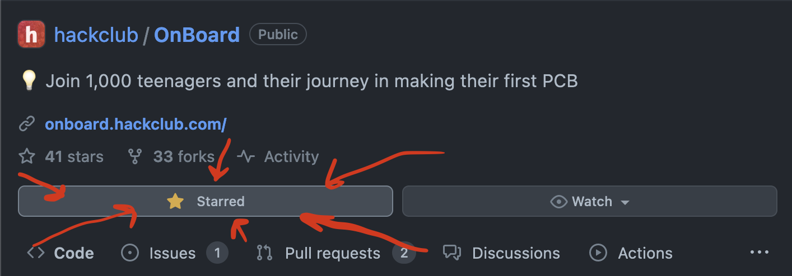
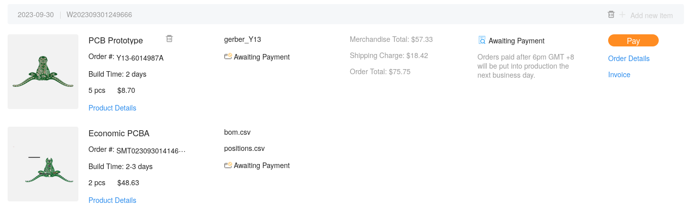
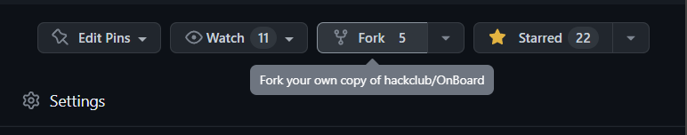
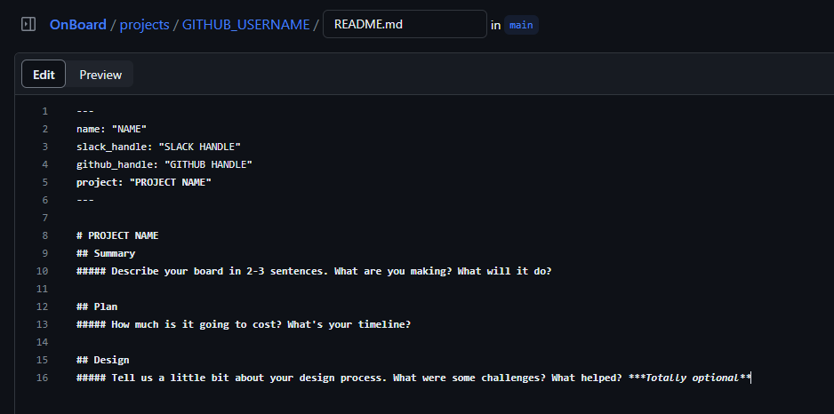
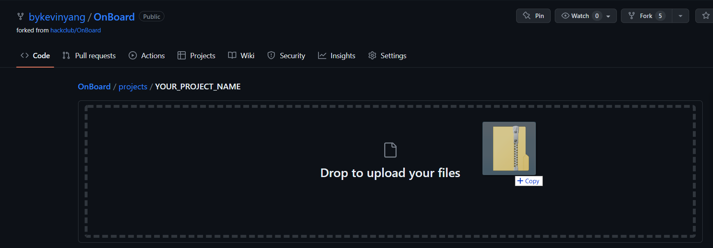
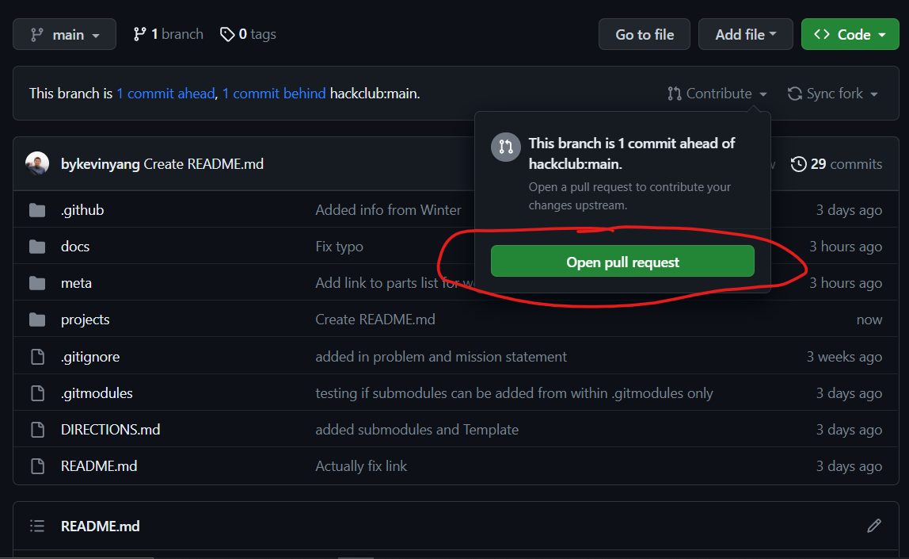
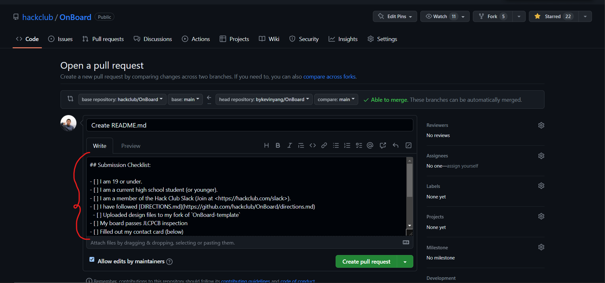
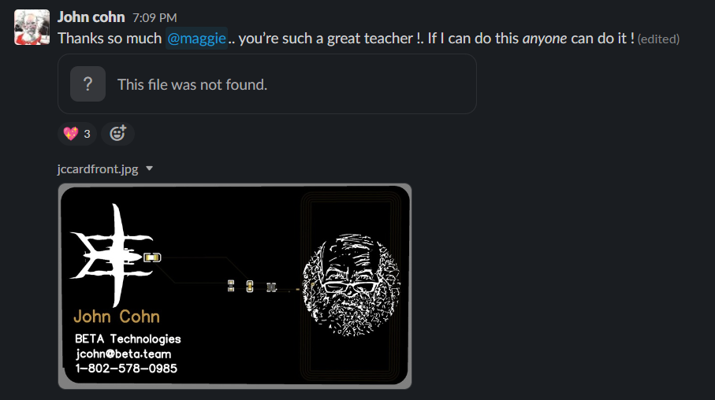

# OnBoard - Get a $100 grant and make a PCB!

> "I’m so glad that young people can create things like PC boards online. May your creativity have no limits!”
>
> _– [Steve Wozniak](https://en.wikipedia.org/wiki/Steve_Wozniak), Apple co-founder endorsing Hack Club OnBoard_

It's easier than ever for high school students to get involved with programming; all you need is a computing device and internet access. Yet, *it's not the same for hardware*. While PCB fabs have greatly increased the accessibility for professionally done boards, there is still no clear way for high school students to jump in. This is where OnBoard comes in.

---

Every student will receive up to $100 to cover PCB manufacturing costs, and join a community of peers– some more beginner and some more experienced.

## Requirements

Every design/submission needs to meet the following constraints to be approved:

- Unique and open-source design
- Must be orderable on JLCPCB or other [approved vendor](https://github.com/hackclub/OnBoard/blob/main/docs/VENDORS.md)
- Must be in high school or younger[^1][^2][^3] and show proof of school enrollment to submit

[^1]: Home school still counts!
[^2]: If you left high school early you can also submit.
[^3]: If you need help with ideas for proof of age, ask in our Slack and we'll help you out! [here](https://hackclub.com/slack/?event=onboard)

## Getting Started

> You can also go through a video with instructions on how to submit your grant!
>
> 

### Star the repo (Optional)

To follow the repo for updates and show you're participating, click the "star" button on the [`onboard`](https://github.com/hackclub/OnBoard/) repo.

### 1. Join `#electronics` on Slack!

Our [`#electronics`](https://hackclub.slack.com/archives/C0587U78RK4) channel[^4] is where the party is getting started! If you haven't already joined, make sure to add yourself to the channel. And for those who are new to the Hack Club slack, sign up to our community of 13k+ makers through [here](https://hackclub.com/slack/?event=onboard) (don't worry, there isn't an application).

[^4]: This link only works after you've joined the slack. Make sure to get an invite [here](https://hackclub.com/slack/?event=onboard) first.

Perhaps ping a little hello to `@Kevin Yang`?

### 2. Design a Board!

It's design time! If you've done this before, you can skip ahead to step 3. Most people reading this will be new to PCB design, so we've made a simple tutorial on making an example board.

Check out our [PCB tutorials](https://jams.hackclub.com/tag/pcb), where you'll make a design from scratch in a free online editor. This is jumping in the deep end- it won't explain everything, but it will give you a taste of what's possible. By the end you probably won't understand _what_ you did or _why_ you did it, but you will have a working design for a board and you'll know how to **tweak** and **edit** the design to make it your own.

_If you get stuck on these tutorials, or want more example projects to learn from, post in the Slack channel to hear from others going on their journeys._

### 3. Upload to a Vendor and Take a Screenshot

Upload your Gerber files to [JLCPCB.com](https://jlcpcb.com/) and add them to you cart. JLCPCB is the default PCB manufacturer, but you can shop around [^5] if there's a specific one you want to use [^6]. Ensure you complete the checkout process by entering your address and selecting a shipping method. Once completed, take a screenshot with all the final costs and shipping!
> If you're curious what all the settings are about or how to order for assembly, check out our [`ordering_from_JLCPCB.md`](./docs/ordering_from_JLCPCB.md) doc!
> To avoid excess shipping fees or customs, check out [`the Shipping Tips`](./community/shipping.md) doc!

It should look like this:

**Note:** Your screenshot is **VITAL** since your project cannot be approved without it. You'll include the screenshot in your PR later.

[^5]: Don't know which ones you can use? Check out [`VENDORS.md`](docs/VENDORS.md) for more info!
[^6]: If outside the US you may be charged customs which aren't covered by the grant! Check beforehand.

### 4. Fork!

Fork the [`onboard`](https://github.com/hackclub/OnBoard/) repo! This is the where you'll add your project files and eventually PR from!

### 5. Add Your Design to Your Project Repo

From your fork of `OnBoard`, create a folder with your project name under `OnBoard/projects`. To do this, go to the projects folder and click `Create new file`.

Then in the box labeled `name your file...`, type in `PROJECT_NAME/README.md`. This creates a README file under a folder called named after your project.

After this, copy and paste the contents of [`TEMPLATE.md`](./projects/!Template/TEMPLATE.md?plain=1) into the text editor and fill it out!

Once your done, press the big green `Commit changes` button to save!

With your README filled out, head over to add files to begin uploading your Gerber, design files, and screen shot of vendor approval.

In all, you should have the following files under your project folder:
- [ ] `README.md`: A filled out [`TEMPLATE.md`](./projects/!Template/TEMPLATE.md?plain=1), renamed to `README.md`
- [ ] `cart.png`: A [screenshot](./docs/images/ordering/cart.png) of your order details
- [ ] `gerber.zip`: This should be the file that you send off to the vendor.
- [ ] `schematic.pdf`: Export the schematic from your EDA program as a PDF.
    - Go to "File > Export > PDF" in EasyEDA's Schematic tab for this.
- [ ] `src/`: Make a folder called `src` and Whatever format your designer outputs should be included.
    - For EasyEDA, you need to File > Export > EasyEDA two JSON files - one from the schematic tab and one from the PCB tab. 
    - Or `name.kicad_pro`, `name_kicad_sch`, `name.kicad_pcb` and `name.step` for KiCAD
    - Or `design.json`, `design.sch`, `design.brd`, etc.

Make sure your file names are exactly the same as above.

Your PR should look like this:

If you have all the above, you're done with this step!

### 6. Create a PR!

Once you've uploaded your files, you can merge them to the main repo through a pull request! Under the contribute tab of your forked repo, click the big green `Open pull request`.

That will bring you to the main repo, where you'll initiate a pull request. Follow the checklist, we'll then review your PR and you'll be off to the races!

### 7. Get approval and order your board!

Once you submit your PR, it needs two approvals:
- One verifying your high school enrollment documents, from HCB.
- Another one from the engineering team, checking that your design follows the grant requirements.

These reviews typically take 24-48 business hours, and if everything is correct, we'll merge your pull request!

After your PR gets merged, it takes up to 24 business hours for you to receive an email from HCB with a virtual credit card. Make sure to check your spam folder. Then, you can order your board!

### 8. Ship it!

Post photos of your board in [`#electronics`](https://hackclub.slack.com/archives/C056AMWSFKJ)! We can't wait to see what you make!

## Example Projects

- [PCB Business Card with NFC, "Hackercard"](https://jams.hackclub.com/jam/hacker-card)
- [Build a USB Hub](https://jams.hackclub.com/batch/usb-hub)
- [Make a Digital Level](https://jams.hackclub.com/batch/sparkletilt-pcb)
