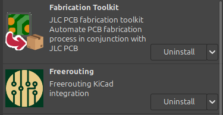
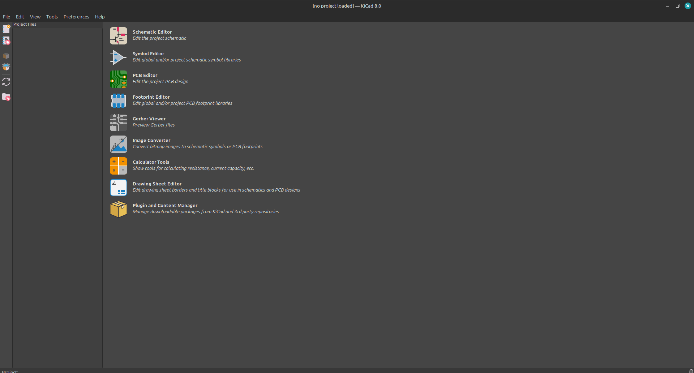
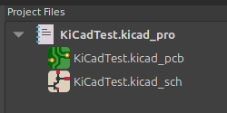
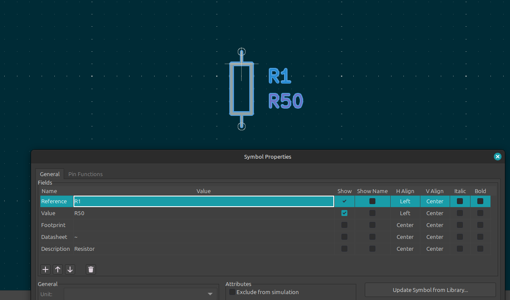
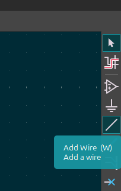

## Tagline
Have you already shipped a couple PCBs and want to challange yourself and use something a little more.. ***"pro"***; [KiCad](https://www.kicad.org/) is here for you! KiCad is another PCB CAD software like EasyEDA but with a ton more features and tools to perfect your craft.

## KiCad Installation
KiCad is available on Windows, Linux and MacOS and is a downloadable software rather than something that runs in your browser like EasyEDA. Download it [here](https://www.kicad.org/download/), selecting your operating system and install location.

### Prerequisites
#### Plugins (Optional)
You might also want to install these two plugins the plugin manager that I find really useful, 

  

#### EasyEDA2KiCad (Optional)
One small setback to using KiCad is you have to fetch all the symbols,footprints and models yourself rather than EasyEDA automatically finding and importing them for you to use. Not to worry though, some smart guy (Wokwi) decided to make a script to port these files to KiCad; [EasyEDA2KiCad](https://github.com/uPesy/easyeda2kicad.py).

You'll need to have Python installed and functional, perferably the latest, then you can install it with `pip install easyeda2kicad`.

To confirm it was install correct, simply type `easyeda2kicad` in your terminal. 

***Windows Troubleshooting*** 

---
You might have to [tinker around](https://graycode.ie/blog/how-to-add-python-pip-to-path/) with system path variables if you're on Windows though.

**Linux Troubleshooting** 

---

If you're on Linux and getting a `Externally Managed Enviornment` error when using `pip install`, you might want to try out [PipX](https://github.com/pypa/pipx).

### Introduction
After launching KiCad and launching it, you should be greeted by a menu similar to this,

You can start by creating a project by pressing File > New Project and giving it a name and save location. That'll create 3 files, the `.kicad_pro` project file, a `kicad.sch` which contains your electrical schematic and `.kicad.pcb` which is your PCB layout similar to EasyEDA's `pcb.json` file.

  

You can open your `.kicad_sch` file, this will be the first file you'll be using. Looks a little scary eh? Don't be concerned, it just has a lot more features than EasyEDA but has all the simple tools that you're used to still there.

You can place basic components like resistors, capacitors and diodes using KiCad's built-in symbol library. This is good for when you're just starting you're project and you want to quickly iterate your design without fine-tuned values of components. Add a resistor, press `ESC` then double click on it and give it a `Value`, 

  

Try this out with a few other symbols and then connect them together with the "Add Wire" tool on the right of the screen,

  

#### Tip
Use [**Labels**](https://www.baldengineer.com/kicad-bus-labels-and-global-labels.html) and [**Power Symbols**](https://klc.kicad.org/symbol/s7/s7.1/). These are very underused in beginner KiCad projects and while they don't serve much functional perpose they make is so much easier to review and understand your design.