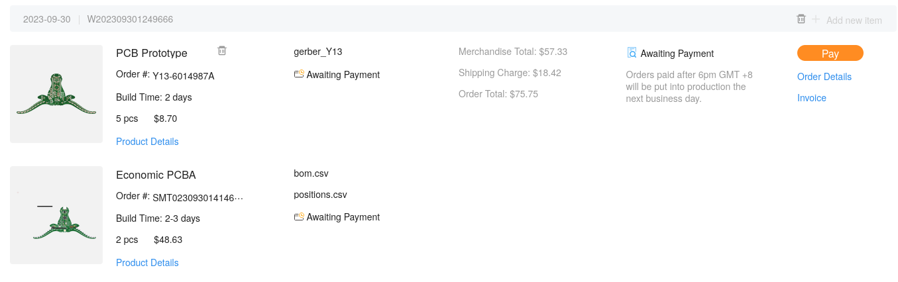

# How to Order from JLCPCB
First time ordering form JLCPCB, or PCBs in general? Or do you just need a refresher on ordering PCBs? Either way, you're in the right place!

## Getting Gerbers
PCB fabs take files called Gerbers. These are essentially outputted directions from whatever software you used (EasyEDA, KiCAD, etc) that contains information about the copper on the board, any silkscreen designs you have, and where to drill holes. Getting Gerbers are easy. They will usually be under some sort of `export` or `output` section of your software.

[//]: # (To-do: Add in section about EasyEDA export)

## Uploading to JLCPCB
Once you have your Gerbers, make sure they are zipped up. This is so that you can upload the folder all in one piece.

## What the Heck are These Settings?
PCB fabs have *A LOT* of settings for board manufacturing, and JLCPCB is no exception. Here's a rundown on what each section means:

### Base Options

- **Base Material**: What material you're going to make the PCBs out of. For OnBoard purposes, you'll board will be made out of FR-4.
- **Layers**: These are the number of copper layers that are in your design. This field should be auto filled with what JLCPCB detects in your Gerbers. 2 or 4 layer PCBs are the most common. Note that anything 6 and above will cost more!
- **Dimensions**: The size of your PCB. Field should be auto-populated based off of your gerbers.
- **PCB QTY**: Number of PCBs you're ordering. The OnBoard grant only allows the minimum, which is usually 5.
- **Product Type**: Don't worry too much about this setting. It mostly deals with what level of care JLCPCB needs to handle your boards with (i.e medical cannot have lead on it). Keep it Industrial/Consumer Electronics.

### PCB Specifications

- **Different Design**: This is the number of designs within your gerber files. This number will be automatically calculated, so don't worry too much about it!
- **Delivery Format**: Do you want single cut PCBs? Or is your board small enough to be made into a panel? For most boards, `Single PCB` will be enough. If you're board is key-chain sized, think about whether you want to make it into a panel. If you have questions about panelization, send them into [`#electronics`](https://hackclub.slack.com/archives/C056AMWSFKJ)
- **PCB Thickness**: This is the thickness of your board. The default size is 1.6 mm. Do not change this - a different thickness can force JLC to use Standard PCBA, which is very expensive.
- **PCB Color**: This is the color of the PCB! Colors other than green, blue, or black can be significantly more expensive, so be careful.
- **Surface Finish**: The coating on the board's pads to protect the exposed copper from corrosion and make soldering easier. HASL is a silvery solder finish. Leaded HASL is cheapest, but it's only a small upcharge for safer lead-free HASL. ENIG is a gold plated finish. It's more expensive than lead-free HASL, but it's very pretty.

<!--
### High-spec Options

- **Outer Copper Weight**:
- **Via Covering**:
- **Board Outline Tolerance**:
- **Confirm Production File**:
- **Remove Order Number**:
- **Flyer Probe Test**:
- **Gold Fingers**:
- **Castellated Holes**:  -->

### PCB Assembly
Choose one of of the two assembly options for your PCB, [assembly by JLCPCB](#assembly-by-jlcpcb) is the quickest and easiest.

#### Assembly by JLCPCB

- **PCBA Type**: Economic. Standard PCBA is very expensive. Some parts, like some connectors and daughter boards, or alternate board thicknesses (other than 1.6mm) require Standard PCBA.
- **PCBA Qty**: Instead of soldering parts to all 5 boards, you can choose to get just 2 to save grant money. They'll ship the other 3 boards without any components on them to you.
- **Confirm Parts Placement**: JLCPCB will manually check whether your parts are oriented correctly for a small fee.

Then on the next screen, upload the `bom.csv` and `positions.csv` (from KiCAD) or `BOM_PCB.csv` and `PickAndPlace.csv` (from EasyEDA).

After that you'll be able to select which parts you want JLCPCB to assemble for you.

If parts like the NFC antenna are unselected, that's fine, just go ahead and click 'Do Not Place' on the popup.

Then, on the orientation screen, make sure all your assembly components are rotated correctly and touching the right pads[^orient]. If there are many issues, go back and check your input files.

[^orient]: Recall that components like resistors and ceramic capacitors are symmetrical, but diodes, LEDs, and ICs are not.

#### Assemble yourself with a stencil
Don't want to pay extra to JLCPCB for assembly? DIY assembly is a great way to save costs and learn a little at the cost that you'll have to supply your own components and have the appropriate tools.

This option is for ***advanced hackers*** only.

At a minimum, you'll need to have a soldering iron + solder, solder paste and a heat gun or heated solder reflower.

**Select the Stencil option in JLCPCB**

See [How to use a PCB Stencil](https://www.youtube.com/watch?v=5AyxuuFjZSI) and [How to Use PCB Stencil-Step by Step Guideline](https://www.pcbelec.com/how-to-use-pcb-stencil.html) for some guides on how to start the process.

### Cart
After you reach the cart, **click checkout** and fill out the information.

> To avoid excess shipping fees or customs, check out [`the Shipping Tips`](../community/shipping.md) doc!

 And in the 3rd box, you can select either "Pay after Review" or "Pay Directly", and click "Submit Order".

You don't have the payment info yet, so just close the tab once it asks you for those.

### PCB Review

Then, once you go to [My Orders](https://jlcpcb.com/user-center/orders/), you should see something like this:

Take a screenshot like that of your order for the OnBoard grant and save it as `cart.png` (for github, it must be a .png file, and named exactly `cart.png`, all lowercase).
