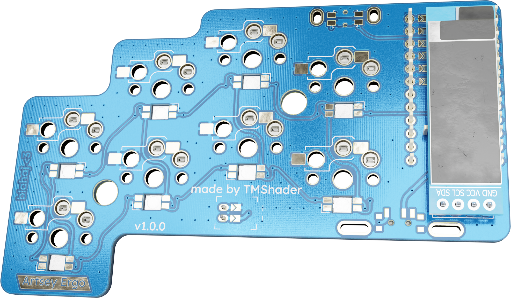

# Artsey Ergo

  

A ZMK powered wireless 8-key ortholinear ergonomic keyboard based on the Artsey keyboard.
This keyboard is especiall people with people who have limited mobility in their hards/fingers,
because it only uses four fingers, 2 keys per finger and they only have to move up or down,
never sideways.

### Why is the PCB special?

The PCB is double sided, so I only have to order one for both hands as it can be flipped around.
This way it's much cheaper to manufacture and assemble.

### What does it cost?

It costs $49.83 with shipping and with a coupon. It uses assembly for only one component
(8 pieces per board), the other components I already have left over from other projects.

### How did I design it?

I designed the basic shape in Ergogen, then refined that in Fusion and then imported to KiCAD
where I completed the routing and the final component placement. Then back to Fusion to design
a case for it.

---

The project has a technical documentation here: [https://artsey-ergo.tmshader.me](https://artsey-ergo.tmshader.me)

And a repo here: [https://github.com/tmshader/artsey-ergo](https://github.com/tmshader/artsey-ergo)