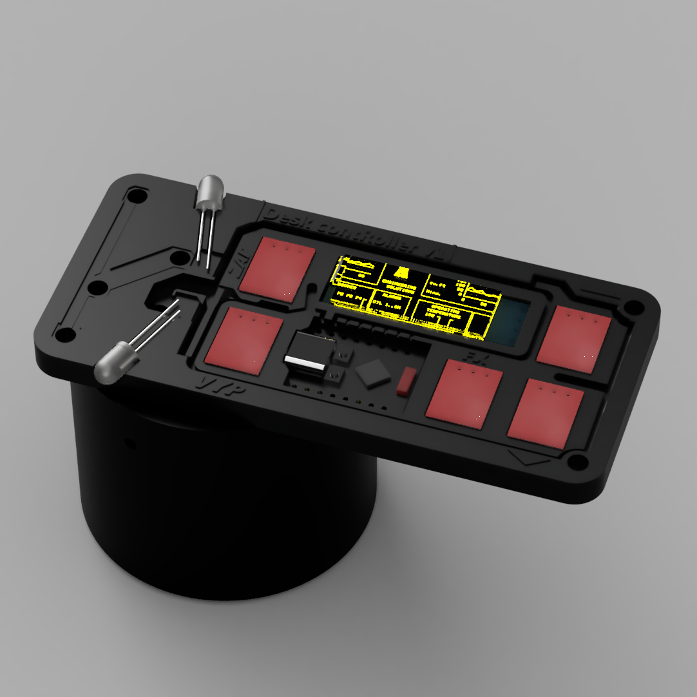
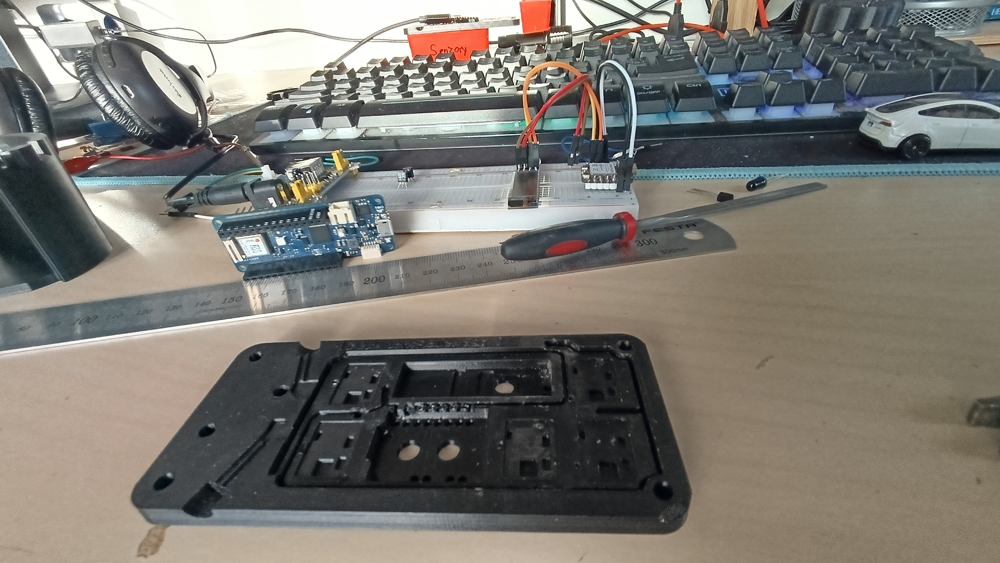
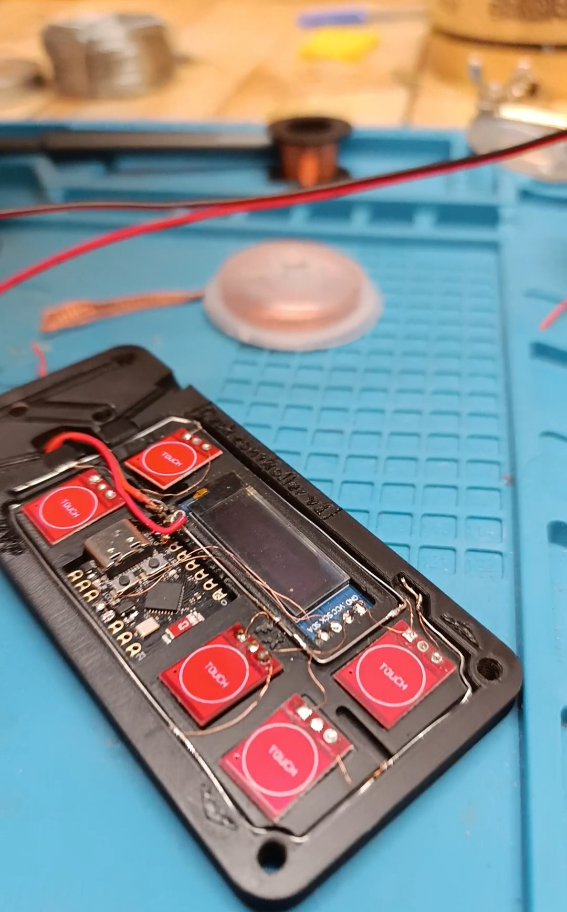
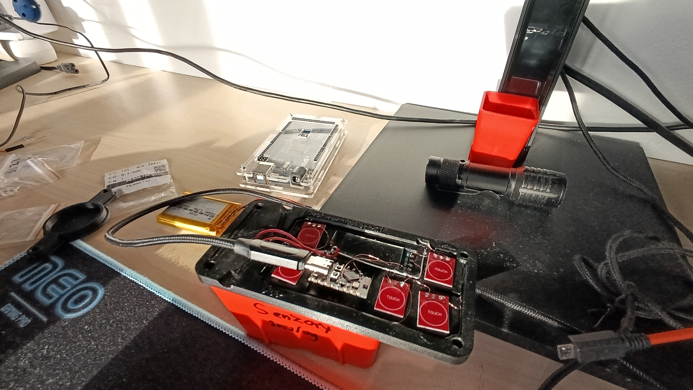

# About Desk contRoller

<!-- Describe your board in 2-3 sentences. What are you making? What will it do? -->
It's a device, placed in the teacher's desk, which combines and fulfills the purpose of 2 IR controllers for the projector and the projection screen in our classroom (we are a new specialization at school - IT, in which we use the projector all the time).
 
> more about in How did I came to this
### Function:
- controlling the projector and projector screen by touch buttons
- displaying time, time till end of class, custom text and other things..
- easy time adjustment through IoT remote app (for example, during a test reduce time, during a boring lesson easily add time) (still considering if controlling interface would be as local webpage hosted on ESP, or school server hosted webpage with Arduino API, or just Arduino IoT Remote mobile app)
- control via wifi, getting current time from NTP server
- impress teachers, some don't put much trust in us or slightly underestimate us and make a small plus to my advantage
- hopefully I'll come up with something else :D
   

### Parts it consists of:
- 3D printed chasi
- XIAO ESP32C3 dev board
- 5× touch buttons (on/off for projector, on/off for screen, one function button)
- 128×32px OLED i2c display
- 2× IR 5mm LEDs
- PCF8574 i2c GPIO expander (already assembled to pcb)
- 2× 0805 green LEDs for status
- probably still MP2307DN(MINI360) DC-DC stepdown converter as power supply
- 2× 10kOhm resistors connecting 3.3v to i2c bus (already assembled to pcb)
- uncertainly 2× NPN transistors and 1× LE12CZ voltage regulator to 1.2v - I´m not sure if I´ll use them there, so just in case I´ve placed 6× 0ohm resistor pins, that I´ll cover in solder based on situation needs

<!-- How much is it going to cost? -->
## Cost
I´ve tried to minimize cost to something corresponding to the project, so rn its about $28.07 for 5 PCBs (all of them assembled), + $8.81 for customs & taxes + $13.84 shipping (the cheapest one), so all that makes `$50.72 in total`
<!-- Tell us a little bit about your design process. What were some challenges? What helped? ***Totally optional*** -->

## How did I came to this idea
So in my classroom at school, we have a projector and a projection screen that are controlled via IR
signals. 
Then I came to the conclusion that having 2 controllers on the table all the time, one of which doesn't
work so well, is not very practical.  
I´ve also noticed that at the same time in the desk there is a 6cm hole in the corner for the cables to the
PC that is not being used, so I got the idea to design a device that would be incorporated into that
hole, it would have  
- 5 touch buttons on it (on/off for projector, on/off for screen, one function button)
- 128x32 oled display that would show time and other data
-  2 small 0805 leds that would indicate status
-  of course 2 IR leds that would send a signal to the
projector and screen
- all this would be controlled by an ESP32C3 supermini dev board from
aliexpress. 
 
Design-wise chasi would be made on a 3d printer, 6mm high, with transparent plexiglass for the internal
components, the holder in the hole would contain a DC regulator for the buttons (thoughts about undervolting), all components
would be connected with hair-thin copper wire and the name of the project was inspired by my class
teacher, Mr. V. Roller, who I then put in the name and voila: Desk contRoller.
  
At least thaťs how I envisioned, then created in fusion 360 and 3d printed version 1 (v1).
But it had a lot of problems:
 

  - unnecessarily small design (rectangle of 110x50x6mm)
    
  - poorly and unreliably soldered wires (there were some 2 not very functional circuits that supplied
    voltage; due to the small design it was also difficult to work and solder; soldering was not very
    strong/quality With material combinations; etc..)
  - finally a non-functioning esp32c3 board
    
  - IR led diodes didn't want to cooperate (they were sending a bad signal + I burned a few of them, they
    can max I.4v, so I bought specific regulators, which I may not use now)
 
..As you could expect, v1 didnt work.
 
Ended up with a chasi, without the glass and practicaly nothing working
 

    
Then I was broken, desperately just scrolling through the ig and thinking, what about making it as a
PCB board either on a cnc mill or ordered, when this interesting OnBoard program popped up and
kicked me into doing something.
 

In EasyEDA, with a little tutorial, I have redesigned the schematic and pcb, added a few components... now I hope for a good
results :D

