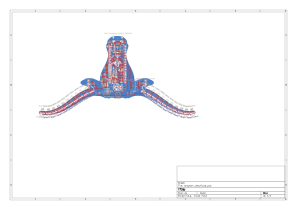
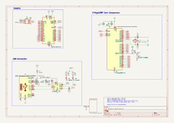
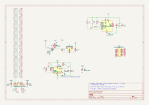
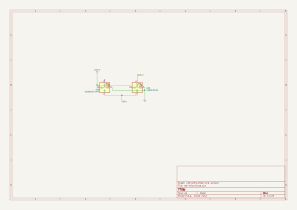

# SparkleTilt: Longhorn LED Level

Find up-to-date info on how to make this board in my [Jam](https://jams.hackclub.com/batch/sparkletilt-pcb)!

## Summary
##### Describe your board in 2-3 sentences. What are you making? What will it do?

This is an Arduino-nano compatible board that also has an I2C accelerometer and a bunch of side-mounted NeoPixels. There are also spots for through-hole 5mm NeoPixels, a battery connector, and li-ion charging hardware. It's shaped like a Longhorn because it's the best mascot ever (it's also great for a level with two points of support and LED horns). The accelerometer will detect the board's orientation relative to gravity and light up LEDs accordingly.

## Plan
##### How much is it going to cost?

$51 including shipping. The PCB is $9.23, parts are $13.88, the rest of the assembly costs are $16.09. The cheapest shipping option is $11.80. 

I'll buy and solder the 5mm NeoPixels, Battery Connector, Switch, USB-C Port, and CH340N myself to reduce extended component cost.

## Design
##### Tell us a little bit about your design process. What were some challenges? What helped? ***Totally optional***

I explain my decisions further in the workshop I'm writing!

## Images

I'll spray paint this side burnt orange ^.

This is the side that is assembled by JLCPCB.

PCB:

Schematic:

