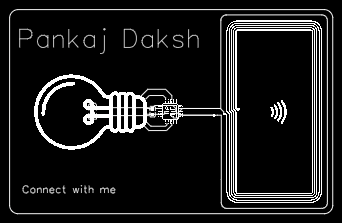

---
Name - Pankaj Daksh

Slack_handle : "@pankajdaksh"

github_handle : "@pankajdaksh"

Project : NFC Personal Card

---

# NFC Personal Card
## Summary
#### I made an NFC Business card for me by following Maggie's tutorial on it.
## Plan
#### Manufaturing cost: $2, Shipping: $15 (could be reduced to cheaper shipping plan). 
### Followed the instructon video provided by maggie (thanks for it), but I have designed it on my own with some inspiration drawn from instructables.its around $30 in total(with coupon), I have selected the cheapest shipping method (for 12-20 days) so that it could save money!

#### I will create it in 20 day because of delivary.

## Design

### starting with a basic design. I added my name, hobbies, and some social icons with my username.

#### The pcb board has two layers, the top layer is supposed to be assembled and have the electrical components with a design.The biggest challenge was routing all connections.

