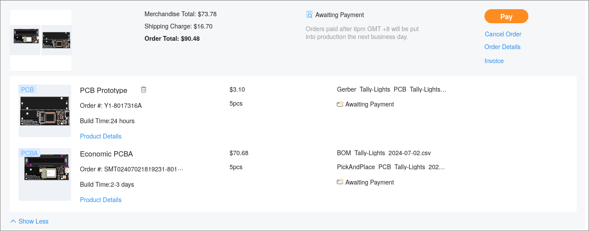

# tally-lights

<!-- Describe your board in 2-3 sentences. What are you making? What will it do? -->
This is a nice little battery operated board with an ESP8266 microcontroller on it that will communicate with the other ESP boards and then illuminate LED's on the board to show a camera operator if their camera is live in a video recording.

<!-- How much is it going to cost? -->

<!-- Tell us a little bit about your design process. What were some challenges? What helped? ***Totally optional*** -->
There were many challenges, first of all I was trying to keep the cost as low as possible, which was a little rough. I ran into the issue that double sided assembly was painfully expensive. Also figured out that the original ESP32 was also waaaaay too expensive. Yeah overall it was a little annoying at times.
