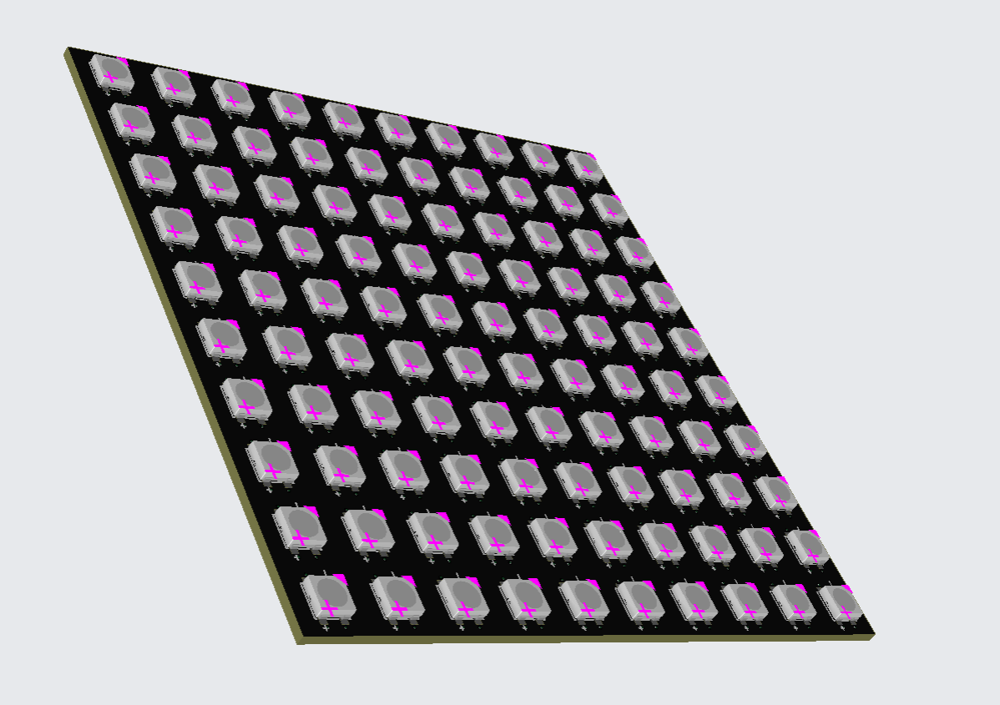

# Thunder_Ceiling

<!-- Describe your board in 2-3 sentences. What are you making? What will it do? -->
500 RGB LED's for my ceiling to make flashes of thunder and lightning at night. 
<!-- How much is it going to cost? -->
Its gonna cost $33, ($2 + $31), and I will be ordering the basic 5 boards + $49 shipping!
total comes to $82. Need a total of 2000, this is the first prototype, will be ordering more with me and my brother's grant.
<!-- Tell us a little bit about your design process. What were some challenges? What helped? ***Totally optional*** -->
Used EasyEDA for designing it. Will solder it on my own and create a thunder effect ceiling by placing LED's every 5cm.
