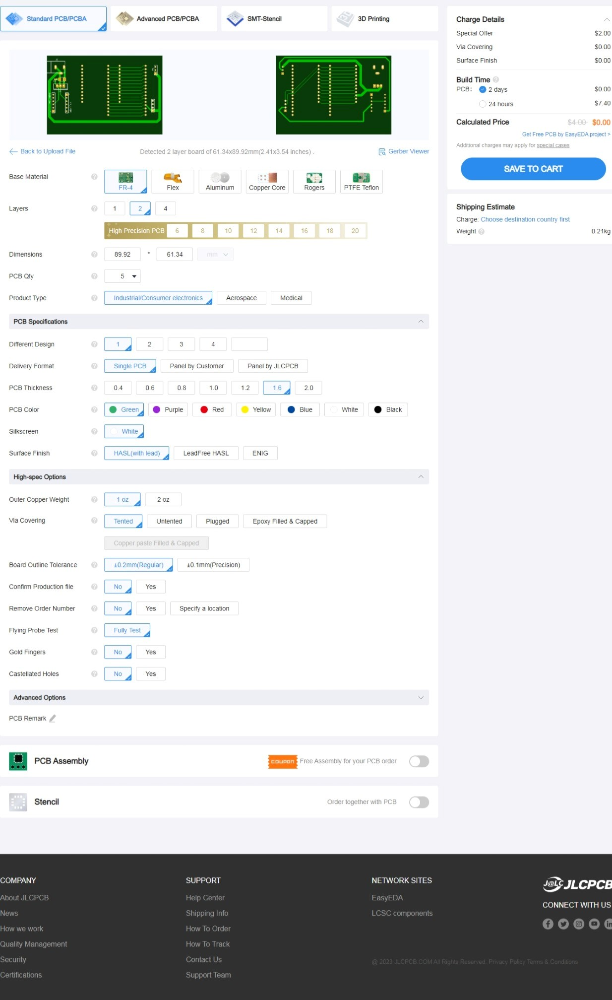
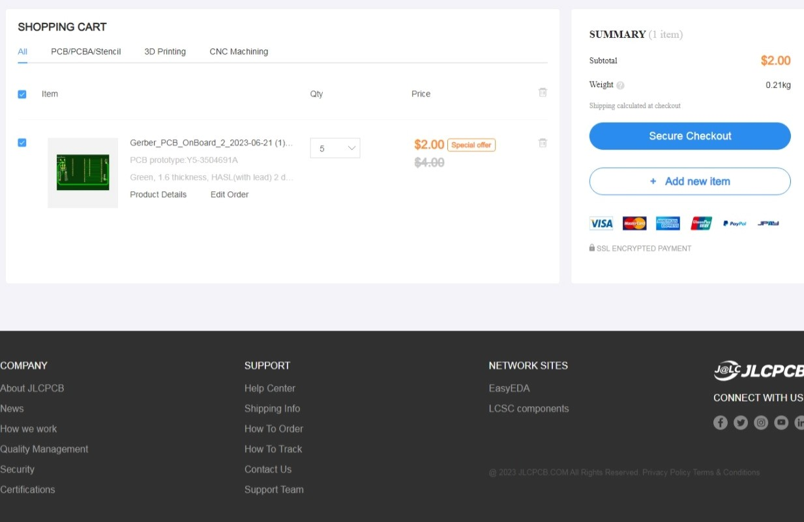

# CoffeDetector
## Summary
##### There are many coffe drinkers out in the world and we know how the heavenly smell of coffe wafts over to us every morning. Wouldn't it be interesting if we could use machine learning and a electrical nose to detect coffe (and other substances) based on their chemical signature? Additionally, using the powerful sensors that are associated with the BME688, make a weather station that can detect harmful gasses like H2Ss, VOCs, etc.

##### TLDR: Make a coffe detector that is connected to the interent that acts as a weather station at the same time.

## Plan
| Component                  | Cost (USD)| Component Source|
|----------------------------|-----------|-----------------|
|Bosch BME688 Development Kit|$50.95     |Sparkfun         |
|SparkFun Thing Plus         |$24.95     |Sparkfun         |
|Sparkfun Shipping           |$5.00      |USPS             |
|Neopixel LED Strip          |$0.00      |Owned            |
|I2c OLED Screen             |$0.00      |Owned            |
|PCB from JLCPCB             |$2.00      |JLCPCB           |
|Shipping for PCBs           |$5.00      |Global Standard Line|
|LM7805                      |$0.00      |Owned            |
|Tax                         |$7.79      |US Government    |
|Total                       |$95.69     |                 |

## Design
##### Figuring out if I wanted to use female pin headers to mount a already pre-existing ESP32 Devboard or creating a custom board from scratch was difficult. However, I setted for female header and the pre-soldered board because I do not own SMD soldering equipment nor do I have the tools to solder most SMD components (especially resistors and capacitors). Another factor I have to consider is a potential external power source as the Neopixel LED strips are quite power hungry. Since the default parts library did not have the footprint for the board, I used SparkFun's official board schematic and imported it.

## Board Approval
##### Uploaded PCB

##### Cart
