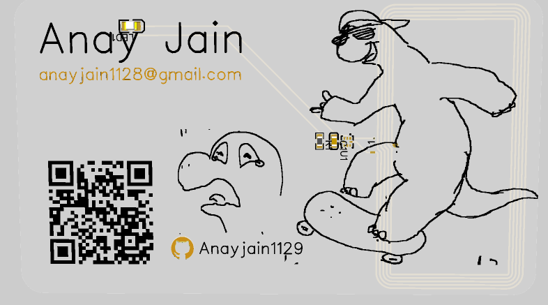

---
Name - Anay jain

Slack_handle : "@anay_ga5547s"

github_handle : "@Anayjain1129"

Project : Hacker Card

---
# Hacker Card

#### Followed the instructon video provided by maggie (thanks for it)
#### Also thanks to all of the people who gave me design inspiration from the hackclub/dinosaurs repo

## Design

The pcb board has two layers, the top layer is supposed to be assembled and have the electrical components with a design.
