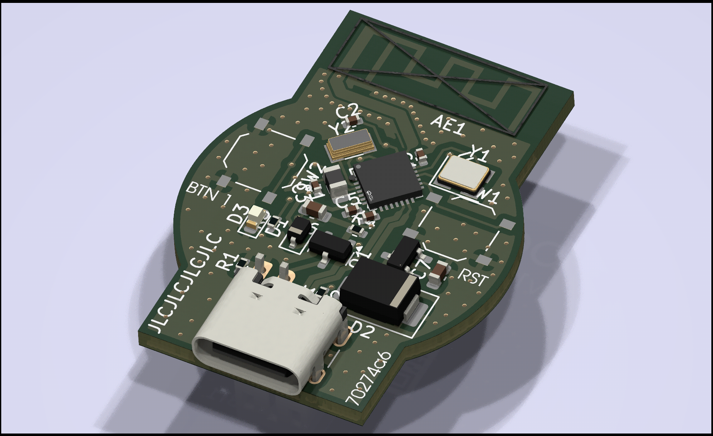

# beartag

Low cost, open source BLE device tracker | Compatible with macless-haystack | Based on the CH571 MCU

<!-- How much is it going to cost? -->

## Cost

$27.02 - $9 coupon + tax = ~$20

<!-- Tell us a little bit about your design process. What were some challenges? What helped? ***Totally optional*** -->

Designing this was pretty easy for the most part - I based the CH571 schematic off of some devboards. Impedance matching for the antenna was challenging, but I was able to get help for that in the slack
