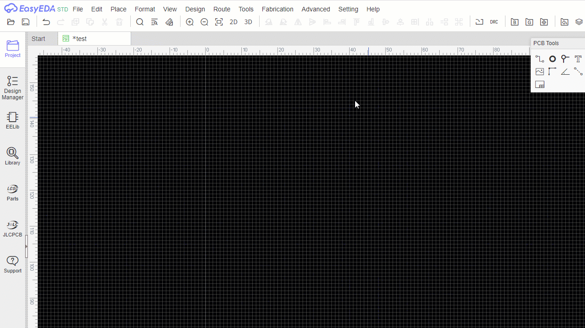
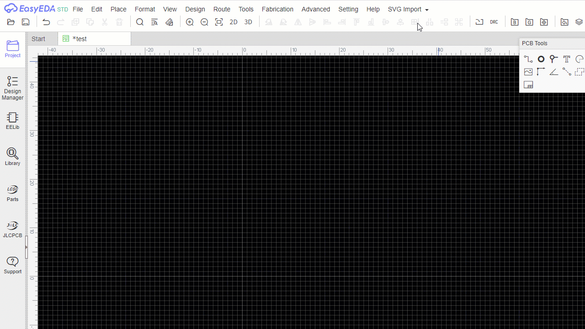
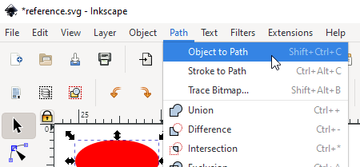
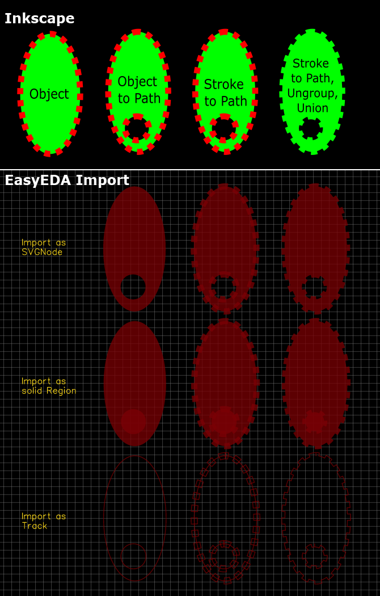

SVG Import Extension for EasyEDA
================================
This is an extension for [EasyEDA](https://easyeda.com/editor) that can import SVG files / paths into EasyEDA without any distorions that the internal Image import produces.
It also allows to import SVGs as solid regions or tracks/outline.

*This is work in progress and not at all finished or polished!*

Installation
------------
Download the latest `extension.zip` from [Releases](https://github.com/xsrf/easyeda-svg-import/releases) and extract the files. Then in [EasyEDA](https://easyeda.com/editor) go to "Advanced" -> "Extensions" -> "Extensions Setting" -> "Load Extension..." -> "Select Files..." and select all extracted files from the `extension` directory.

Updates
-------
There is no update function for extensions in EasyEDA. Please remove the extension from the "Extensions Setting" and install the new version.

Usage
-----

Issues
------
To be fair, I wrote this for a single usecase: Importing procedurally generated SVGs from [OpenSCAD](https://www.openscad.org/) into EasyEDA. And it works fine.
OpenSCAD creates very simple SVGs just using `path` elements.

SVG however supports [more primitives](https://developer.mozilla.org/en-US/docs/Web/SVG/Tutorial/Basic_Shapes) than just `path`. Other primitives, like `line`, `circle`, `polyline`, `rect` etc. are not supported. The main reason for this is that all of these primitives can also be expressed as `path` - which is the most powerful primitive in SVG.

Preparing SVGs using Inkscape
-----------------------------
### Convert objects to paths
As mentioned, the SVGs are required to use `path` elements to be properly imported. If your imported SVG is missing some parts or you get the message "No path-Tags found 😕" you may need to convert it.

An easy way is by using the free software [Inkscape](https://inkscape.org/) and opening your SVG with it. After that, select all elements of your Drawing (`CTRL`+`A`) - or just those missing after import - and convert them to paths using **Path** -> **Object to Path** or **Stroke to Path** (depends on your drawing, try it). Then just save it as a new file.

**Path** -> **Union** or **Simplify** may also help reducing complexity if you have an SVG with lots of overlapping shapes.

### Translating/Moving objects/groups
When you translate/move objects or a group of objects, the translation may actually not show up in the imported SVG. To fix this, just select the group of objects and hit **Object** -> **Ungroup** and (if you want) **Object** -> **Group** again.

### Working with text
To import Text, it has to be converted with **Object to Path**. This will generate one object for each letter of the text which will get hard to work with in EasyEDA. Use **Path** -> **Combine** to combine all letters to a single path.

### What the import will look like

Still issues?
-------------
If you still have issues importing an SVG, feel free to open an issue.