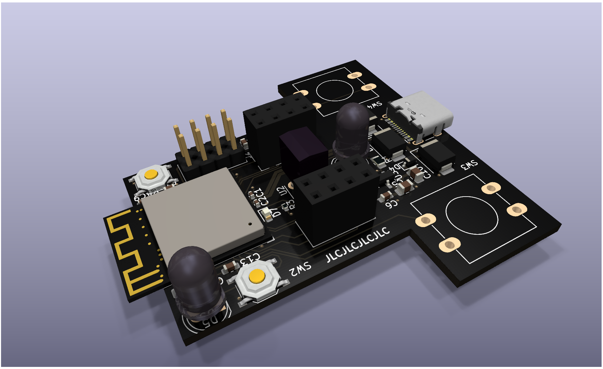

# Home Assistant RF + IR Bridge

A wireless module for adding RF and IR capabilities to Home Assistant. Built on an ESP32-S2.

Includes slots for two CC1101 modules and two IR LEDs.

The firmware will be written using the ESP-IDF framework, and will communicate with Home Assistant using MQTT. It will be used to add Home Assistant support for some IR lights I have.

<!-- How much is it going to cost? -->

## Cost

$25.15 + $8 shipping + $2.73 tax = $35.88

I have a $20 coupon, so the final cost is **$15.88**.

<!-- Tell us a little bit about your design process. What were some challenges? What helped? ***Totally optional*** -->

This isn't the first PCB I've made, so the design process went pretty smoothly. I used an ESP32 devboard schematic as a reference for much of this design.

The biggest challenge was probably calculating the appropriate resistance for the IR LEDs, but I was able to get help with this on Slack.
