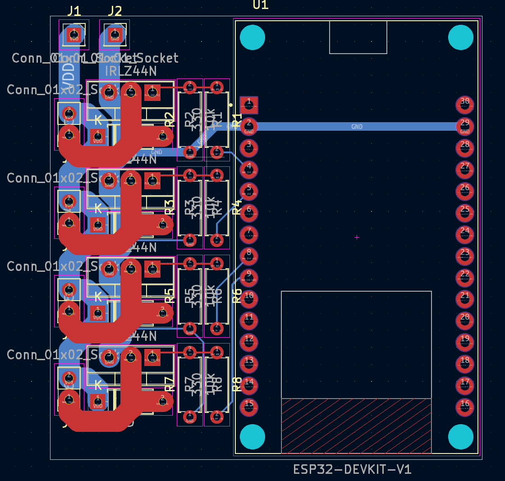

# multichannel

multichannel high-amperage PWM driver for anything from 5v LEDS to 20V motor, networked and serial via ESP32

It controlls 4 outputs via PWM

PCB costs 10.33 because of tariff, parts cost excluded